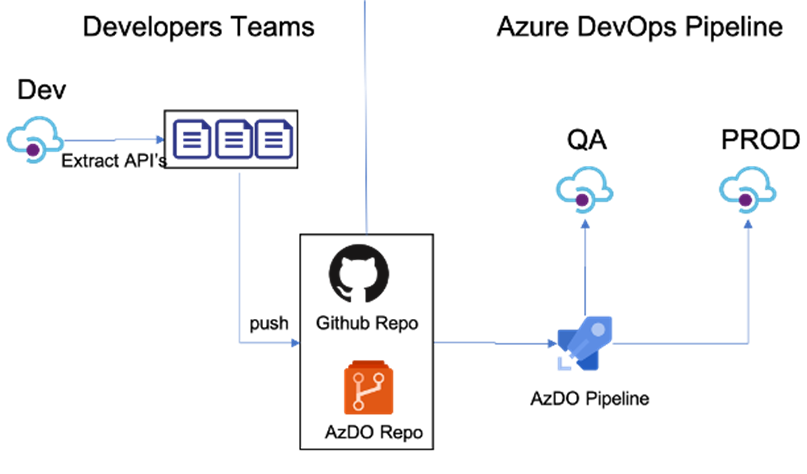

# API Management

### Administration 

SuperUsers should be given the  **API Management Service Contributor** role to manage the APIM service.

#### Reference

- https://docs.microsoft.com/en-us/azure/api-management/api-management-role-based-access-control

Disaster Recovery:

- https://docs.microsoft.com/en-us/azure/api-management/api-management-howto-disaster-recovery-backup-restore

### Sizing and Scalability

- [API Management pricing](https://azure.microsoft.com/pricing/details/api-management)
- https://docs.microsoft.com/en-us/azure/api-management/api-management-capacity
- https://docs.microsoft.com/en-us/azure/api-management/upgrade-and-scale

### Observability

- https://docs.microsoft.com/en-us/azure/api-management/observability

#### Azure Monitor

- https://docs.microsoft.com/en-us/azure/api-management/howto-use-analytics

#### External Export

- [How to log events to Azure Event Hubs in Azure API Management](https://docs.microsoft.com/en-us/azure/api-management/api-management-howto-log-event-hubs)

### DevOps

The configuration of APIM can be managed via IaC practices and deployed via CD practices

#### Workflow

##### Service

1. A ARM Template will capture the core service configuration
2. A build pipeline packages the ARM template into a pipeline artifact for use by a release pipeline.
3. A multi-stage release pipeline is responsible for API Managment service into the target environments.  

##### API's

1. Developers will use a lab/sandbox version of APIM to define API's
2. The ARM templates for the API's can be extracted using the [APIM DevOps Toolkit](https://github.com/Azure/azure-api-management-devops-resource-kit)
3. The extracted ARM Templates should be commited to source countrol.
4. A build pipeline packages the ARM templates into a pipeline artifact for use by a release pipeline.
5. A multi-stage release pipeline is responsible for deploying the API's to the target environments.

#### Reference
- https://techcommunity.microsoft.com/t5/azure-architecture-blog/adopting-a-devops-process-in-azure-api-management-using-azure/ba-p/1519141
- [CI/CD for API Management using Azure Resource Manager templates](https://docs.microsoft.com/en-us/azure/api-management/devops-api-development-templates)
- https://github.com/Azure/azure-api-management-devops-resource-kit

### Reference

- https://azure.github.io/api-management-resources/
- https://feranto.github.io/azure-apim-lab/
