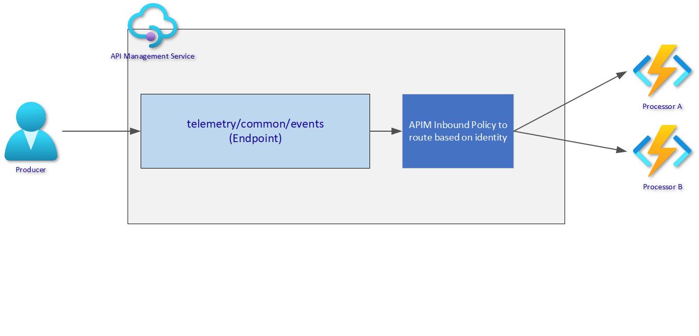
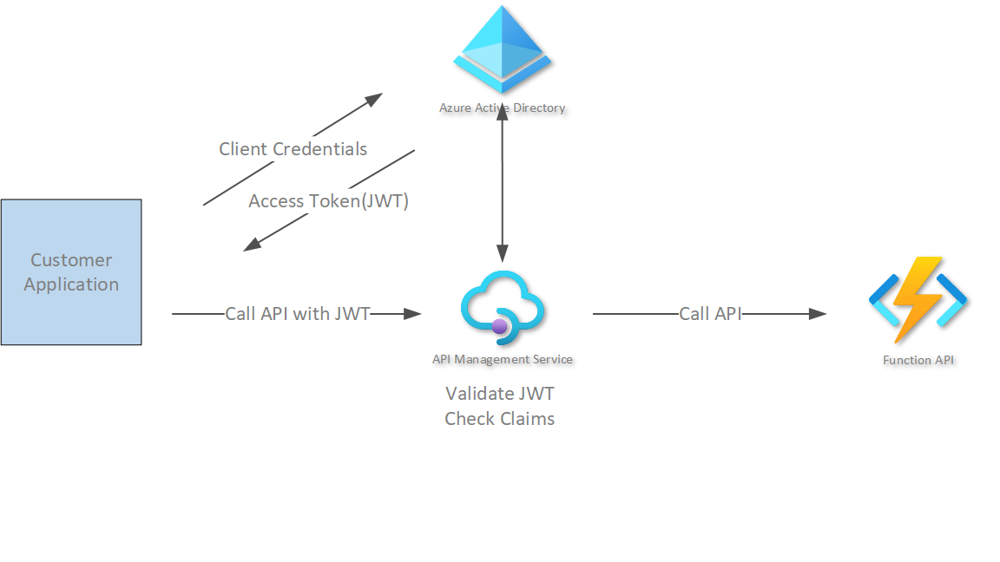

# Demo API Managment - Routing

This project contains a reference of using and identity(JWT) to route an enpoint to different implementations.

### Overview

### Routing Policy

[Sample Routing Policy](sample-policy.xml)
